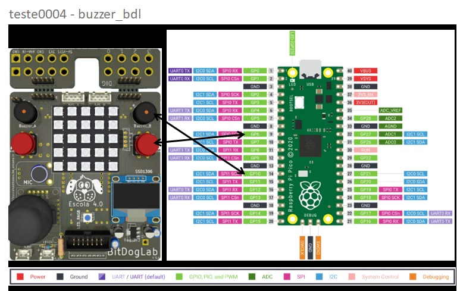

[](https://hardware.org.br/)

[](https://alfecjo.github.io/antonio_almeida_embarcatech_HBr_2025/)

# 🚀 EmbarcaTech 2025 - Phase I 

## 📚 Objective
This repository presents the initial Embedded Systems projects developed during EmbarcaTech 2025 - Phase I at HBr Campinas. It includes foundational code, tests, basic documentation, and essential resources that laid the groundwork for the advanced implementations in Phase II.

---

### Important Note:
Due to the CMake installation and build configuration being optimized for minimal modification, all examples in this list will need to be adjusted to match the configuration of the machine on which they are run. Without these adjustments, the code may not behave as expected!
___

```cmake
# Minimum CMake version required
cmake_minimum_required(VERSION 3.12)

# Pull in SDK (must be included before defining the project)
include(pico_sdk_import.cmake)
include(pico_extras_import_optional.cmake)

# Define the project and supported languages
project(pico_examples C CXX ASM)

# Set C and C++ standards
set(CMAKE_C_STANDARD 11)
set(CMAKE_CXX_STANDARD 17)

# Check for minimum SDK version
if (PICO_SDK_VERSION_STRING VERSION_LESS "2.1.0")
    message(FATAL_ERROR "Raspberry Pi Pico SDK version 2.1.0 (or later) required. Your version is ${PICO_SDK_VERSION_STRING}")
endif()

# Set project source path
set(PICO_EXAMPLES_PATH ${PROJECT_SOURCE_DIR})

# Configure timeout for USB debug output (optional)
if (NOT DEFINED PICO_STDIO_USB_CONNECT_WAIT_TIMEOUT_MS)
    set(PICO_STDIO_USB_CONNECT_WAIT_TIMEOUT_MS 3000)
endif()

# Initialize the Pico SDK
pico_sdk_init()

# Include helper for setting project URL
include(example_auto_set_url.cmake)

# Add the executable for the target test, like the example below
add_executable(blink_bdl    
    blink_bdl.c
)

# Include directories
target_include_directories(ssd1306_oled_bdl
    PUBLIC
    ${CMAKE_CURRENT_SOURCE_DIR}/include
)

# Link necessary libraries
target_link_libraries(ssd1306_oled_bdl pico_stdlib hardware_i2c hardware_adc)

# Enable USB and disable UART for standard I/O
pico_enable_stdio_usb(ssd1306_oled_bdl 1)
pico_enable_stdio_uart(ssd1306_oled_bdl 0)

# Generate additional output files (map/bin/hex/uf2)
pico_add_extra_outputs(ssd1306_oled_bdl)

# Add the project URL (for use in examples browser)
example_auto_set_url(ssd1306_oled_bdl)

# Check if hardware I2C is available and handle accordingly
if (TARGET hardware_i2c)
    add_subdirectory_exclude_platforms(ssd1306_oled_bdl)
else()
    message("Skipping I2C examples as hardware_i2c is unavailable on this platform")
endif()

```
___

### 📌 Description

- This initial test consists of blinking an LED using the Raspberry Pi Pico. It simulates the use of GPIOs that will activate LED_PIN_LIGHT (a heat-generating light source) and LED_PIN_FAN (a fan that removes hot air from the environment).
- The code was developed in C/C++ and tested in the Bitdoglab environment.

### 📝 Document the dependencies and environment configurations.

Complete C code: blink_bdl.c
CMake file: CMakeLists.txt

### 🔧 Status

🚧 Tested


___

### 📌 Description

- His initial test consists of using Button A and Button B to activate the RGB LED when pressed, using the Raspberry Pi Pico.
- The code was developed in C/C++ and tested in the Bitdoglab environment.

### 📝 Document the dependencies and environment configurations.

Complete C code: button_buzzer_bdl.c
CMake file: Cmakefiles.txt 

### 🔧 Status

🚧 Tested


___

### 📌 Description

- His initial test consists of using Button A and Button B to activate the RGB LED when pressed, using the Raspberry Pi Pico.
- The code was developed in C/C++ and tested in the Bitdoglab environment.

### 📝 Document the dependencies and environment configurations.

Complete C code: blink_rgb_bdl.c
CMake file: Cmakefiles.txt 

### 🔧 Status

🚧 Tested


___

### 📌 Description

- His initial test consists of using Button A and Button B to activate the RGB LED when pressed, using the Raspberry Pi Pico.
- The code was developed in C/C++ and tested in the Bitdoglab environment.

### 📝 Document the dependencies and environment configurations.

Complete C code: buzzer_bdl.c
CMake file: Cmakefiles.txt 

### 🔧 Status

🚧 Tested


___
### 🚀 Adicionando teste0005 Bitdoglab - ssd1306_bdl

### 📌 Description

- His initial test consists of using Button A and Button B to activate the RGB LED when pressed, using the Raspberry Pi Pico.
- The code was developed in C/C++ and tested in the Bitdoglab environment.

### 📝 Document the dependencies and environment configurations.

Complete C code: ssd1306_bdl.c
CMake file: Cmakefiles.txt 

### 🔧 Status

🚧 Tested


___
### 🚀 Adicionando teste0006 Bitdoglab - dh22_bdl

### 📌 Description

- His initial test consists of using Button A and Button B to activate the RGB LED when pressed, using the Raspberry Pi Pico.
- The code was developed in C/C++ and tested in the Bitdoglab environment.

- The code structure allows for efficient interchangeability, demonstrating how the separation of responsibilities between functionalities enables parts of the system to be reused in different solutions. In this way, the chassis itself can serve as a foundation for new applications, even if they have completely different functionalities.

- Key benefits of this approach
    ✔ Code reuse – Reduces rework and improves efficiency.
    ✔ Faster development – Solutions can be built quickly.
    ✔ Cost reduction – Less time and effort required.
    ✔ Quality assurance – Code already tested and validated.

- This strategy not only optimizes development but also makes systems more modular, scalable, and sustainable in the long run. 🚀

- This application could easily serve as the main project for the final delivery...

- The code was developed in C/C++ and tested in the Bitdoglab environment.

### 📝 Document the dependencies and environment configurations.

Complete C code: dht22_bdl.c
CMake file: Cmakefiles.txt 

### 🔧 Status

🚧 Tested


___

### 📌 Description

- His initial test consists of using Button A and Button B to activate the RGB LED when pressed, using the Raspberry Pi Pico.
- The code was developed in C/C++ and tested in the Bitdoglab environment.

### 📝 Document the dependencies and environment configurations.

Complete C code: goertzel_bdl.c
CMake file: Cmakefiles.txt 

### 🔧 Status

🚧 Tested
___
### 📋 List of tests  
✔ **🟢 Test 0001 - blink_bdl**  
✔ **🟢 Test 0002 - button_buzzer_bdl**  
✔ **🟢 Test 0003 - blink_rgb_bdl**  
✔ **🟢 Test 0004 - buzzer_bdl**  
✔ **🟢 Test 0005 - ssd1306_bdl**  
✔ **🟢 Test 0006 - dht22_bdl**  
✔ **🟢 Test 0007 - goertzel_bdl**  
