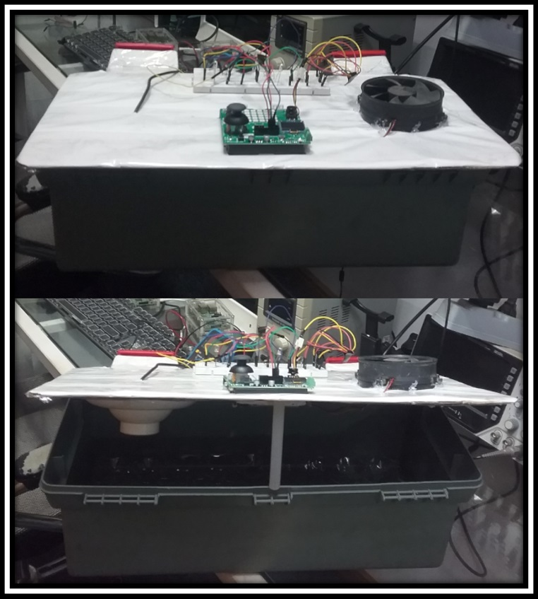

## ⚠️ Important Note:
You may need to adjust the `CMakeLists.txt` file according to your development environment, as each setup might differ based on the developer's system configuration. Without these adjustments, the code may not behave as expected.

---

> The setup used for building this solution, as well as the tests, follows the logic outlined below:

```cmake
#Versionamento
cmake_minimum_required(VERSION 3.12)

# Pull in SDK (must be before project)
include(pico_sdk_import.cmake)
include(pico_extras_import_optional.cmake)

#Raiz do projeto
project(pico_examples C CXX ASM)

set(CMAKE_C_STANDARD 11)
set(CMAKE_CXX_STANDARD 17)

if (PICO_SDK_VERSION_STRING VERSION_LESS "2.1.0")
    message(FATAL_ERROR "Raspberry Pi Pico SDK version 2.1.0 (or later) required. Your version is ${PICO_SDK_VERSION_STRING}")
endif()

set(PICO_EXAMPLES_PATH ${PROJECT_SOURCE_DIR})

# If you want debug output from USB (pass -DPICO_STDIO_USB=1) this ensures you don't lose any debug output while USB is set up
if (NOT DEFINED PICO_STDIO_USB_CONNECT_WAIT_TIMEOUT_MS)
    set(PICO_STDIO_USB_CONNECT_WAIT_TIMEOUT_MS 3000)
endif()

# Initialize the SDK
pico_sdk_init()

#Adiciona script customizado
include(example_auto_set_url.cmake)

# Adiciona o executável
add_executable(ssd1306_oled_bdl
    src/ssd1306_oled_bdl.c
    src/ssd1306.c
    src/adc_setup.c
    src/i2c_setup.c
    src/oled_setup.c
    src/temperature.c
)

# Diretórios de inclusão
target_include_directories(ssd1306_oled_bdl
    PUBLIC
    ${CMAKE_CURRENT_SOURCE_DIR}/include
)

# Linka as bibliotecas necessárias
target_link_libraries(ssd1306_oled_bdl pico_stdlib hardware_i2c hardware_adc)

# Habilita USB e desabilita UART
pico_enable_stdio_usb(ssd1306_oled_bdl 1)
pico_enable_stdio_uart(ssd1306_oled_bdl 0)

# Gera arquivos extras (map/bin/hex/uf2)
pico_add_extra_outputs(ssd1306_oled_bdl)

# Adiciona URL do projeto
example_auto_set_url(ssd1306_oled_bdl)

if (TARGET hardware_i2c)
    add_subdirectory_exclude_platforms(ssd1306_oled_bdl)
else()
    message("Skipping I2C examples as hardware_i2c is unavailable on this platform")
endif()
```
___
### 🚀 **Project Presentation**

📌 This project envisions a compact egg incubator designed for home use or small poultry breeders. It is an automated system that controls temperature to ensure an optimal hatching environment. The solution uses a Raspberry Pi Pico W – BitDogLab board to monitor and regulate temperature. It activates a resistive lamp for heating and a fan for air circulation, which consequently cools the environment when needed.

With a capacity for 36 eggs and dimensions of 20 cm (height), 15 cm (width), and 45 cm (length), the incubator can be used for both domestic purposes and small-scale commercial poultry breeding, increasing the success rate of incubation.

A 128x64 OLED display shows temperature information, using the built-in sensor on the board.

In summary, it aims to maintain a stable and automatic temperature environment within the required range.
___

### 📝 **The code was developed in C/C++ and tested on the BitDogLab platform.**

### 🔧 **Status**

 🚧 Tested 🟢
___

### 📋 **List of Tests that Contributed to the Project Development:**

🟢 Teste 0001 - blink_bdl
🟢 Teste 0002 - button_buzzer_bdl
🟢 Teste 0003 - blink_rgb_bdl
🟢 Teste 0004 - buzzer_bdl
🟢 Teste 0005 - ssd1306_bdl
🟢 Teste 0006 - goertzel_bdl
___

