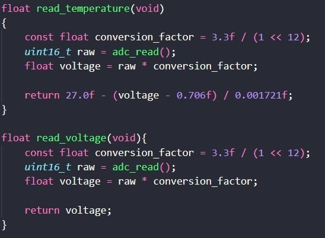

## ⚠️ Important Note:
You may need to adjust the `CMakeLists.txt` file according to your development environment, as each setup might differ based on the developer's system configuration. Without these adjustments, the code may not behave as expected.

---

### 🚀 **Assignment**

### 📌 Countdown Timer with Event Logging via Interrupts

---

## Overview

The goal of this program is to read the **internal temperature sensor** of the RP2040 (used in Raspberry Pi Pico or [BitDogLab](https://github.com/BitDogLab/BitDogLab) boards) and display the temperature value on both the terminal and an OLED screen. The value is read via the onboard ADC (Analog-to-Digital Converter), then converted to voltage and finally translated into temperature in degrees Celsius.

---

## 🛠️ Logic Explanation

## Enhanced Project004 – Raspberry Pi Pico W or [BitDogLab](https://github.com/BitDogLab/BitDogLab)

## Step-by-Step Logic

### 1. **Reading the Internal Temperature Sensor**

The RP2040 includes a built-in temperature sensor, which is connected to **ADC channel 4**. To read this temperature:

- The ADC is initialized using `adc_init()`.
- The internal sensor is enabled with `adc_set_temp_sensor_enabled(true)`.
- The ADC input is set to channel 4 using `adc_select_input(4)`.

The raw ADC value is read using `adc_read()` and then converted to a voltage using the following formula:

### 🖼️ Hardware Setup

This section illustrates the hardware used in this project to help replicate the setup accurately.

### 🔧 Components Used

- Raspberry Pi Pico W or [BitDogLab](https://github.com/BitDogLab/BitDogLab)
- SSD1306 OLED Display (I2C)
- USB cable (for power and programming)

---

### 📝 **The code was written in C and tested using the [BitDogLab](https://github.com/BitDogLab/BitDogLab) platform.**

---

### 🔧 **Status**

✅ Tested – Working properly 🟢

---

### 📋 **Checklist of Test Cases That Supported Project Development**

- 🟢 Test 001 – Success! Time-based.

---

### 🖼️ Hardware Setup

---

## 🐳 Run in a Containerized Environment

Tired of manual setups and toolchain installations? Want to skip the setup and run the projects in a ready-to-use development environment?

🚀 **Launch all projects using our custom Docker image with full Pico SDK support!**  
The image includes build tools, dependencies, and sample projects — all pre-configured.

👇 Visit the repository and get started now:  

  

- 💡 Use this container to compile, test, and develop your Raspberry Pi Pico and [BitDogLab](https://github.com/BitDogLab/BitDogLab) projects instantly — no manual installations needed!
- 🛠️ Created and maintained by the author of this project to simplify and accelerate development.

---

## 👤 Author
**[Antonio Almeida](https://alfecjo.github.io/) Student**

Have suggestions or found a bug?
Feel free to contribute or open an [issue](https://github.com/alfecjo/antonio_almeida_embarcatech_HBr_2025/issues). 🚀

---

- ## Return to the main page
  
